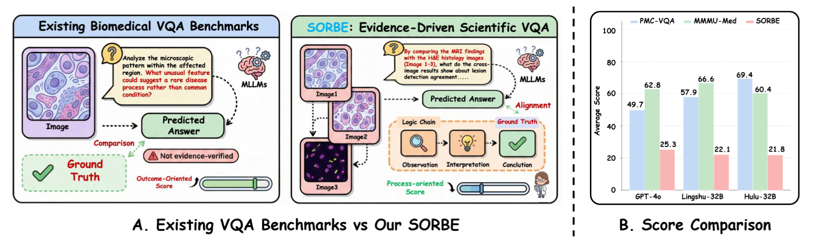
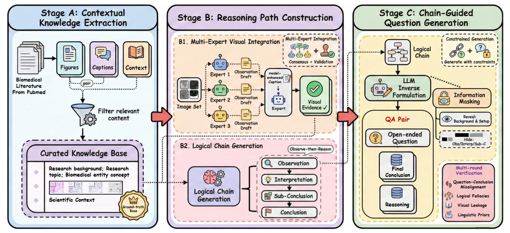
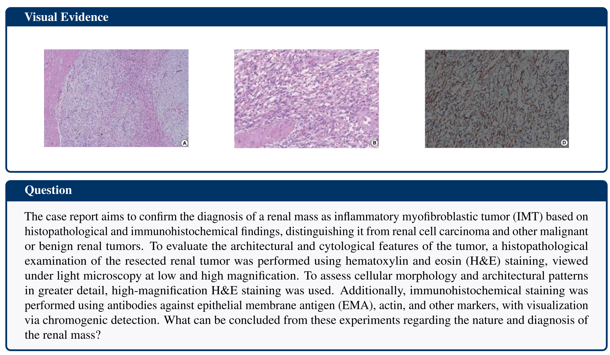
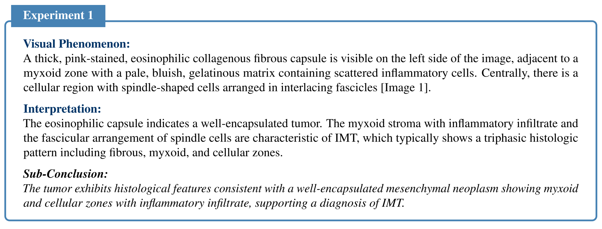
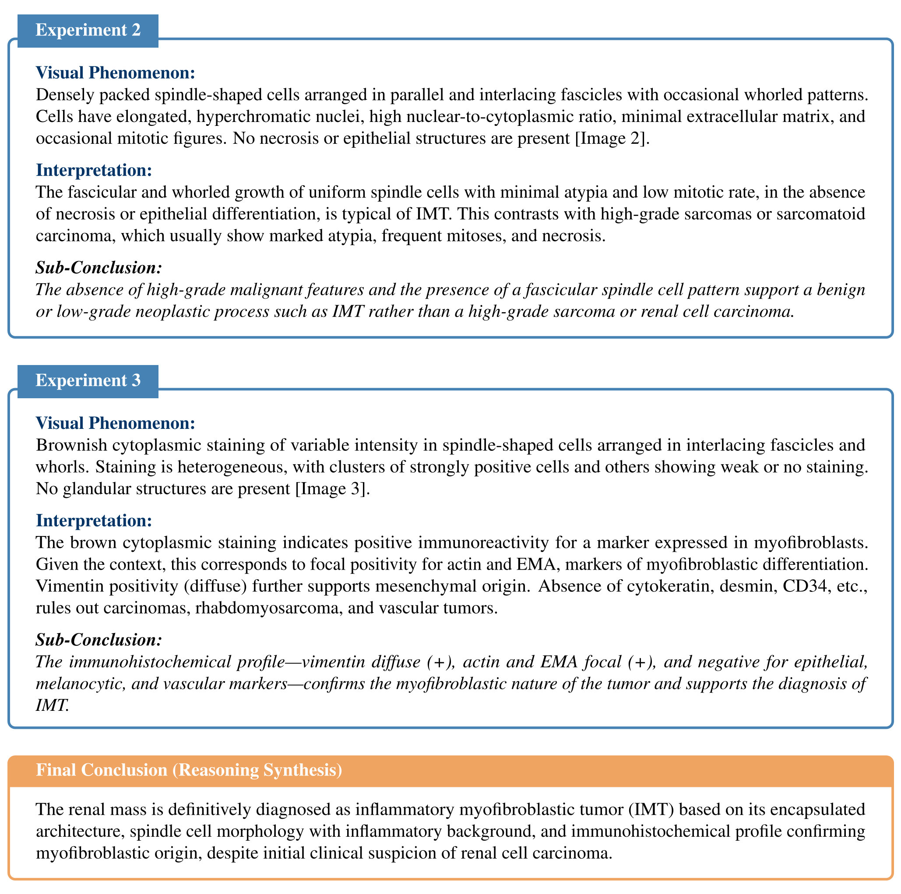
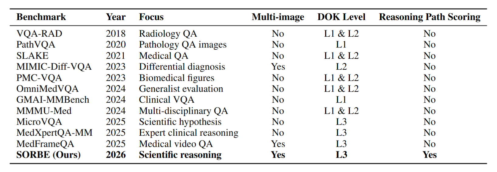
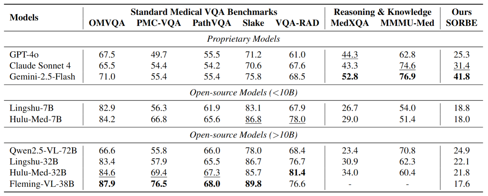
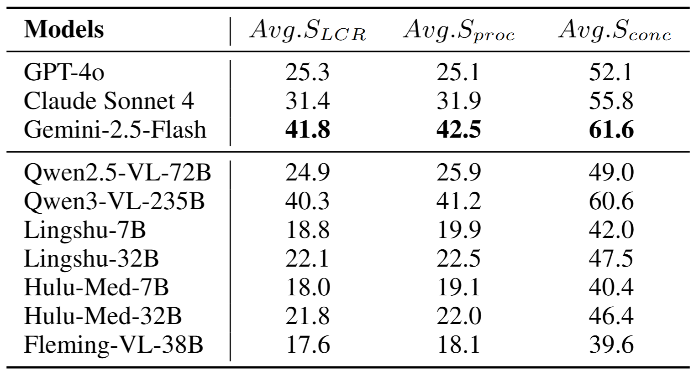

Benchmarking the Scientific Mind: Toward Evaluation of Complex-Reasoning Biomedical VQA
---

### Introduction

---

Despite progress of Multimodal Large Language Models (MLLMs) in biomedical visual question answering (VQA), existing benchmarks provide limited assessment of their scientific reasoning capabilities. Most datasets adopt single-image question construction and outcome-oriented evaluation, where correctness is judged by answer plausibility rather than alignment with experimental evidence. Such formulations fail to capture the evidence-constrained, multi-step nature of biomedical reasoning, and obscure whether models can derive conclusions through causal interpretation of experimental observations.

To address these critical gaps in reasoning evaluation, we propose a principled benchmark construction framework that reconstructs scientific reasoning paths directly from biomedical literature. By jointly modeling clusters of experimentally related images together with their captions and context, the framework generates tightly coupled question–reasoning–answer triples that require multi-image integration and explicit evidence-driven inference. Based on this framework, we introduce SORBE - Scientific Observation Reasoning for Biomedical Evaluation, a large-scale multi-image biomedical VQA benchmark designed to evaluate evidence alignment and multi-step experimental reasoning. Under a process-oriented evaluation metric, state-of-the-art biomedical-specialized MLLMs exhibit substantial performance degradation, revealing systematic limitations in evidence grounding and causal reasoning that are not reflected by existing benchmarks.


Figure 1. (A) Comparison between the typical biomedical VQA Benchmark and our SORBE. Our process-oriented scoring evaluates
verifiable reasoning structure rather than subjective explanation quality. (B) Scores of the three models, GPT-4o, Lingshu-32B, and Hulu-32B, on PMC-VQA, MMMU-Med, and our SORBE, respectively.


Figure 2. Overview of Benchmark Construction Framework. (A) Contextual Knowledge Extraction, which distills structured
experimental metadata from unstructured biomedical literature; (B) Reasoning Path Construction, which extracts visual evidence and
constructs logic chains from images and contextual knowledge; and (C) Question Generation & Filtering, which produces open-ended
questions and filters out low-quality questions.

---

### Installation

---

Install Python 3.9.25

```
conda env create -f med_qa_env.yml
conda activate med_qa_env
```

Our framework operates on a plug-and-play architecture, allowing for the flexible replacement of any  models. By default, the system is configured as follows: for image-to-text generation via the VLM_PROMPT_TEMPLATE, it utilizes a suite of vision-language models, specifically Qwen3-VL-235B-A22B-Instruct, Lingshu-32B, Hulu-Med-32B, and Fleming-VL-38B. For all other functional steps, Qwen3-235B-A22B-Instruct serves as the primary text-based backbone.

If you want to use a different model, please change the settings in each code section as follows:

For the text model settings, this document defaults to using Qwen3-235B-A22B-Instruct.

```
local_text_api_key = "[YOUR OPENAI API KEY]"
local_text_model = "[YOUR MODEL NAME]"

local_text_client = AsyncOpenAI(
    api_key=local_text_api_key,
    base_url="[YOUR URL]", 
    timeout=120.0
)
```

For the visual model settings, this paper uses Qwen3-VL-235B-A22B-Instruct, Lingshu-32B, Hulu-Med-32B, and Fleming-VL-38B.

```
local_vl_api_key = "[YOUR OPENAI API KEY]"
local_vl_model = "[YOUR MODEL NAME]"

local_vl_client = AsyncOpenAI(
    api_key=local_vl_api_key,
    base_url="[YOUR URL]", 
    timeout=120.0
)
```

---

### Datasets

---

You can use the `Data\data_final.json` file in the dataset to download a demo of the processed SORBE dataset, which contains 200 data points for you to run subsequent QC, evaluation, and testing code. The complete dataset will be released later.

Below is an example from our dataset.








---

### Usage

---

Quick Start: You can use the xxx.ipynb notebooks in SORBE\qa_generation to implement each step of the QA generation process separately, allowing you to easily view the results after each pipeline stage.

Full Run: To process the entire dataset, you need to use qa_generation.py in SORBE\qa_generation.

```
python qa_generation.py
```

Run the code above to generate data end-to-end.

---

### Evaluation

---

You will need to use `evaluation-current.ipynb` and `analyze_results.py` from the SORBE\evaluation directory. The former can be used to obtain answers from different models, while the latter can evaluate and score the different models based on their logical reasoning chains.

### **Quick Start Guide**

#### **Step 1: Complexity Labeling (DOK Grading)**

Open `dok_judge-current.ipynb` and run the main loop to categorize your dataset.

```python
# Core logic: Iterate through dataset and assign DOK levels
for entry in dataset:
    prompt = JUDGE_PROMPT_TEMPLATE.format(question=entry['question'])
    response = await get_response_async(..., next_content=prompt, model="qwen-plus")
    entry['dok_level'] = response['content']
```

#### **Step 2: Model Evaluation (Inference)**

Running the Multi-Model Experiment
In evaluation-current.ipynb, the following cell is the main entry point for running the entire evaluation pipeline. It orchestrates multiple models to answer questions across different experimental groups.

Key Steps to Run:
Define Experiment Parameters: Set your target models, question types, and data sources in the experiment_params and filter_groups dictionaries.

Execute the Async Loop: Run the cell containing the code below. This will launch all model requests concurrently.

###### The actual core trigger in the notebook

```
tasks = []
for i, key in enumerate(filter_groups):
    filter_group = filter_groups[key]
    # This function handles the full flow: Model Answer -> LLM Judge -> Save Result
    task = complete_experiment(
        filter_group["answer_model_list"],
        filter_group["judge_model"],
        experiment_params["question_type"],
        experiment_params["difficulty"],
        experiment_params["data_name"],
        experiment_params["data_under_judge"],
        filter_group["image_source"],
        filter_group["tag"],
        rel_position=i*len(filter_group["answer_model_list"])
    )
    tasks.append(task)

Results are typically cached or saved into the eval_results/ directory automatically.
```

#### **Step 3: Analyze & Score Results**

Run the analysis script via command line to generate statistical reports.

```bash
# Run this in your terminal
python analyze_results.py --file_path "eval_results/your_model_output.json"

```

*This will output: Conclusion Scores, Process Scores (Logic), and LCR (Reasoning-Conclusion balance).*

---

### **Key Metrics Defined**

* **DOK Level:** Cognitive depth (1-3).
* **Conclusion Score:** Final answer accuracy.
* **Process Score:** Correctness of the reasoning steps.
* **LCR:** Harmonic mean of Conclusion and Process scores.

---

Review Results

Table 1. Overview of Key Biomedical VQA Benchmarks. Our benchmark stands out by integrating multi-image visual signals with
complete research logic, moving beyond discrete recognition to holistic scientific reasoning.



Table 2. Comparison with state-of-the-art models on general medical VQA benchmarks and reasoning tasks. SORBE is our proposed benchmark. The best results in each group are highlighted in bold.



Table 3. Fine-grained scores of models on the SORBE benchmark.

*Avg.S*<sub>proc</sub>, *Avg.S*<sub>conc</sub> and *Avg.S*<sub>LCR</sub> mean the average of all scores *S*<sub>LCR</sub>, *S*<sub>proc</sub> and *S*<sub>conc</sub> in SORBE.



---

# License

This repository is licensed under the [Apache-2.0 License](https://anonymous.4open.science/r/ChartAgent/LICENSE). All open-sourced data is for resarch purpose only.

# Citation

If you use this code for your research, please cite our paper.

# Acknowledgements

We are very grateful to the following GitHub repositories, which provided valuable code libraries or datasets:


 [[MedXpertQA\]](https://medxpertqa.github.io/),[[Hulu-Med\]](https://github.com/ZJUI-AI4H/Hulu-Med), [[Lingshu\]](https://huggingface.co/lingshu-medical-mllm/Lingshu-32B), [[MicroVQA\]](https://huggingface.co/datasets/jmhb/microvqa), [[Qwen3\]](https://github.com/QwenLM/Qwen3),

